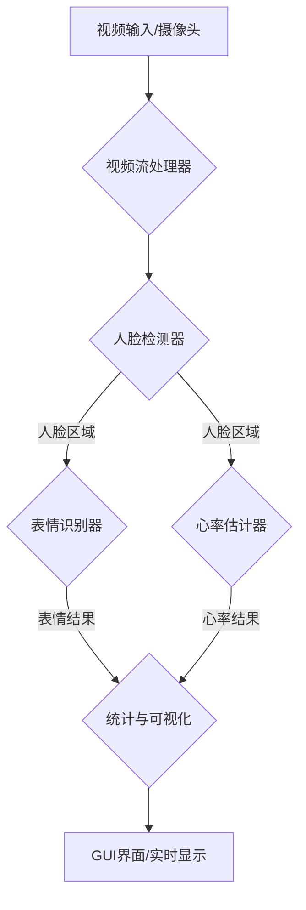

# 计算机视觉情感与心率分析系统 

[](https://www.python.org/downloads/)
[](https://pytorch.org/)
[](https://opencv.org/)
[](LICENSE)

一个结合了先进计算机视觉和深度学习技术的综合性分析平台，旨在通过标准网络摄像头实时捕捉和分析人脸的情感与生理信息。

---

##  核心功能

-   **实时人脸检测**: 支持多种检测算法（Haar, dlib），高效识别人脸。
-   **7种核心表情识别**: 实时分析“愤怒”, “厌恶”, “恐惧”, “高兴”, “悲伤”, “惊讶”, “中性”等7种核心表情。
-   **非接触式心率估计**: 基于远程光电容积描记（rPPG）技术，通过分析面部肤色变化来估计心率。
-   **实时数据可视化**: 现代化的PyQt5图形界面，通过图表实时展示表情分布和心率变化趋势。
-   **灵活的模型管理**: 支持 PyTorch (`.pth`), TensorFlow/Keras (`.h5`), ONNX (`.onnx`) 等多种模型格式，系统可自动检测并加载。
-   **提供模型训练脚本**: 内置简易的模型训练脚本 (`train_simple_model.py`)，用户可以使用 `FER2013` 数据集轻松训练自己的模型。
-   **模块化设计**: 系统采用高度模块化的架构，便于维护、扩展和二次开发。

---

##  系统简介

本系统是一个集成了先进计算机视觉与深度学习技术的综合性分析工具，旨在通过标准的网络摄像头实时捕捉、分析和量化人类面部信息。系统核心功能包括：

-   **非接触式生理信号监测**：通过远程光电容积描记（rPPG）技术，无创地估计用户的心率，适用于健康监测、情绪压力评估等场景。
-   **自动化情绪识别**：利用深度卷积神经网络（CNN），实时分析面部的微表情，识别出七种基本情绪状态（如高兴、悲伤、愤怒等）。
-   **实时数据可视化**：提供友好的图形用户界面（GUI），将视频、检测结果、情绪分布饼图和心率变化曲线图实时展示，方便用户直观地理解分析结果。
-   **模块化与可扩展性**：系统采用高度模块化的架构设计，使得各个功能（如人脸检测、表情识别、心率估计）可以独立测试、优化或替换，便于二次开发和功能扩展。

---

##  如何开始

请按照以下步骤安装和运行系统。

### **步骤 1: 克隆仓库**

```bash
git clone <your-repository-url>
cd CV_Analysis_System
```

### **步骤 2: 安装依赖**

建议使用Python 3.8+环境。

```bash
# 安装所有必要的Python库
pip install -r requirements.txt
```
*注意：如果需要使用`.h5`格式的模型，你还需要安装TensorFlow:*
```bash
pip install tensorflow
```

### **步骤 3: 准备表情识别模型 (?重要?)**

系统需要一个预训练模型来进行表情识别。你有以下三种选择：

#### **选项 A: 自己训练模型 (????? 最推荐)**

这是最可靠、最灵活的方法，能确保模型100%兼容。

1.  **下载数据集**: 从Kaggle下载[FER2013数据集](https://www.kaggle.com/datasets/msambare/fer2013)，并将`fer2013.csv`文件放到`CV_Analysis_System/`或`dataset/`目录下。
2.  **运行训练脚本**:
    ```bash
    # 快速训练 (约10-20分钟, 准确率55-65%)
    python train_simple_model.py --csv_file fer2013.csv --mode quick
    
    # 完整训练 (约1-2小时, 准确率60-70%)
    python train_simple_model.py --csv_file fer2013.csv --mode full
    ```
3.  训练完成后，模型将自动保存为 `models/emotion_model.pth`。

#### **选项 B: 下载预训练模型 (????)**

你可以从Kaggle等平台下载训练好的模型文件 (`.pth`, `.h5`等)。

1.  将下载的模型文件放入 `models/` 目录。
2.  **重命名为** `emotion_model.pth` 或 `emotion_model.h5`。
3.  系统启动时会自动检测并加载该模型。

> 详细指南请查阅 **`MODEL_GUIDE.md`** 和 **`QUICK_START_模型获取.md`**。

#### **选项 C: 创建模拟模型 (?? 仅用于测试)**

如果你只是想快速启动和测试系统功能，可以创建一个模拟模型。

```bash
python download_models.py
```
**警告**: 模拟模型使用随机权重，**识别准确率极低**，仅用于程序演示。

### **步骤 4: 启动系统**

```bash
# 启动交互式命令行菜单
python run_system.py

# 或者直接启动GUI
python run_system.py --mode gui
```

---

##  技术原理

### **人脸检测 (Face Detection)**

-   **技术**: 默认使用OpenCV的 **Haar级联分类器**。
-   **原理**: 基于Adaboost算法训练，利用Haar特征（边缘、线性、中心环绕）进行高效的对象检测。它速度快、资源占用低，非常适合实时视频处理。

### **表情识别 (Emotion Recognition)**

-   **技术**: 基于 **卷积神经网络 (CNN)**。
-   **流程**:
    1.  **图像预处理**: 从视频帧中提取人脸区域，转换为48x48像素的灰度图。
    2.  **特征提取**: 图像通过多层卷积和池化操作，自动学习从低级（边缘、角点）到高级（眼睛、嘴巴形状）的面部特征。
    3.  **分类**: 提取的特征被送入全连接层，通过Softmax函数输出7种表情（愤怒、高兴、悲伤等）的概率分布。
    4.  **输出**: 选择概率最高的表情作为最终识别结果。

### **心率估计 (Heart Rate Estimation)**

-   **技术**: **远程光电容积描记 (rPPG)**，一种非接触式测量技术。
-   **原理**:
    1.  **信号源**: 心脏每次搏动时，血液容积的变化会引起面部皮肤颜色的微弱周期性变化。这种变化虽然肉眼无法察觉，但可以被摄像头捕捉。
    2.  **区域选择 (ROI)**: 在检测到的人脸区域中选择信号稳定的额头或脸颊作为感兴趣区域。
    3.  **信号提取**: 连续的视频帧中，提取ROI区域的平均颜色信号（通常是绿色通道），形成原始的时间序列信号。
    4.  **信号处理**: 通过滤波（去除光照变化、头部微小移动等噪声）和去趋势处理，增强心跳信号。
    5.  **频率分析**: 对处理后的信号进行 **快速傅里叶变换 (FFT)**，找到信号中能量最强的频率，即心跳频率。
    6.  **心率计算**: 将心跳频率转换成每分钟心跳次数（BPM）。

---

##  系统架构与工作流程

系统采用模块化的流水线架构，数据处理流程清晰。

### **系统架构图**



### **工作流程详解**

1.  **视频捕获**: `VideoStreamHandler` 模块从摄像头或视频文件以多线程方式高效读取视频帧，避免阻塞主线程。
2.  **人脸检测**: 每一帧图像被送入 `FaceDetector` 模块，该模块使用Haar级联分类器快速定位图像中的所有人脸，并输出其边界框坐标。
3.  **并行处理**:
    -   **表情识别**: `EmotionRecognizer` 模块接收人脸区域，通过CNN模型进行推理，输出最可能的表情标签和置信度。
    -   **心率估计**: `HeartRateEstimator` 模块接收相同的人脸区域，提取rPPG信号并将其存入一个固定大小的缓冲区。
4.  **数据分析与统计**:
    -   `StatisticsTracker` 模块收集每个时间点的表情和心率数据，计算如情绪分布、平均心率等统计指标。
    -   当心率估计器的信号缓冲区填满时，它会进行一次完整的心率计算。
5.  **结果可视化**:
    -   所有处理结果（带有人脸框和表情/心率标签的视频帧、统计图表）被发送到 `main_gui.py`。
    -   GUI界面负责将这些信息实时渲染并呈现给用户，包括动态更新的视频画面、情绪饼图和心率曲线图。

---

##  项目结构

```
CV_Analysis_System/
├── main_gui.py              # 主GUI程序
├── run_system.py            # 系统启动脚本
├── check_env.py             # 环境检查脚本
├── requirements.txt         # 依赖文件
│
├── models/                  # 存放模型文件 (如 emotion_model.pth)
│
├── emotion_recognizer.py    # 表情识别模块
├── face_detector.py         # 人脸检测模块
├── heart_rate_estimator.py  # 心率估计模块
├── statistics_tracker.py    # 统计追踪模块
├── video_handler.py         # 视频处理模块
│
├── train_simple_model.py    # (新增) 模型训练脚本
├── download_models.py       # (新增) 模拟模型创建脚本
├── download_real_model.py   # (新增) 模型下载助手
├── convert_h5_to_pth.py     # (新增) H5模型转换与测试工具
│
├── MODEL_GUIDE.md           # (新增) 完整模型使用指南
└── README.md                # (本文) 项目说明文档
```

---

##  常见问题 (Troubleshooting)

1.  **摄像头无法打开?**
    -   确保摄像头未被其他程序占用。
    -   检查摄像头驱动是否正确安装。
    -   尝试更换USB接口。

2.  **表情识别效果很差?**
    -   **这是正常的！** 如果你使用的是默认的模拟模型，它的准确率极低。
    -   **解决方案**: 请务必按照【如何开始】的**步骤3**，**自己训练**或**下载一个真实的预训练模型**。

3.  **心率检测不准确?**
    -   确保面部光照充足且均匀。
    -   尽量保持头部稳定，避免大幅度移动。
    -   检查ROI选择区域是否正确。

4.  **加载`.h5`模型出错?**
    -   确保已安装TensorFlow: `pip install tensorflow`。
    -   确认`.h5`模型的架构与系统兼容（输入48x48，输出7分类）。

---

##  许可证

本项目基于MIT许可证。详情请参阅 `LICENSE` 文件。
