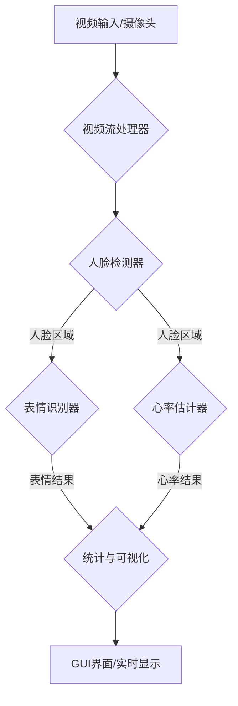

# 计算机视觉情感与心率分析系统

基于深度学习和计算机视觉技术的实时人脸表情识别与心率估计系统。

## 系统简介

本系统是一个集成了先进计算机视觉与深度学习技术的综合性分析工具，旨在通过标准的网络摄像头实时捕捉、分析和量化人类面部信息。系统核心功能包括：

- **非接触式生理信号监测**：通过远程光电容积描记（rPPG）技术，无创地估计用户的心率，适用于健康监测、情绪压力评估等场景。
- **自动化情绪识别**：利用深度卷积神经网络（CNN），实时分析面部的微表情，识别出七种基本情绪状态（如高兴、悲伤、愤怒等）。
- **实时数据可视化**：提供友好的图形用户界面（GUI），将视频、检测结果、情绪分布饼图和心率变化曲线图实时展示，方便用户直观地理解分析结果。
- **模块化与可扩展性**：系统采用高度模块化的架构设计，使得各个功能（如人脸检测、表情识别、心率估计）可以独立测试、优化或替换，便于二次开发和功能扩展。

## 功能特性

- **实时人脸检测**: 支持多种检测算法（Haar级联、dlib）。
- **表情识别**: 识别7种基本表情（愤怒、厌恶、恐惧、高兴、悲伤、惊讶、中性）。
- **心率估计**: 基于rPPG技术的非接触式心率检测。
- **统计分析**: 实时统计和可视化分析。
- **友好界面**: PyQt5图形界面，操作简单直观。

## 技术原理

本系统整合了多个计算机视觉领域的关键技术，其核心原理如下：

### 人脸检测 (Face Detection)

系统采用经典的**Haar级联分类器**作为默认的人脸检测方法。该方法基于Adaboost算法，利用Haar特征（类似于边缘、线性和中心环绕特征）进行高效的对象检测。它速度快、资源占用低，非常适合实时视频流处理。

### 表情识别 (Emotion Recognition)

表情识别功能基于一个**卷积神经网络 (CNN)** 模型。其工作流程如下：
1.  **图像预处理**：从检测到的人脸区域中提取出48x48像素的灰度图像。
2.  **特征提取**：图像通过多层卷积和池化层，自动学习从低级（边缘、角点）到高级（眼睛、嘴巴形状）的面部特征。
3.  **分类**：提取的特征被送入全连接层，最终通过Softmax函数输出一个包含七种表情（愤怒、厌恶、恐惧、高兴、悲伤、惊讶、中性）概率分布的向量。
4.  **结果输出**：选择概率最高的表情作为最终的识别结果。

> **模型说明**: 系统默认使用一个**改进的模拟模型**，其效果优于随机权重，但仍建议用户参考 `MODEL_GUIDE.md` 获取并集成一个真正的预训练模型以达到最佳性能。

### 心率估计 (Heart Rate Estimation)

心率估计采用**远程光电容积描记 (rPPG)** 技术，这是一种非接触式的测量方法：
1.  **信号源**：心脏每次搏动时，血液流经面部血管，会引起皮肤表面颜色的微弱周期性变化。这种变化虽然肉眼无法察觉，但可以被摄像头捕捉到。
2.  **感兴趣区域 (ROI)**：系统在检测到的人脸中选取信号稳定的区域（如前额），以减少噪声干扰。
3.  **信号提取**：在连续的视频帧中，提取ROI区域的平均颜色信号（通常是绿色通道，因为它对血红蛋白的变化最敏感），形成一个原始的时间序列信号。
4.  **信号处理**：
    - **去趋势**：移除由光线变化、头部微小移动等引起的缓慢变化的信号趋势。
    - **滤波**：使用带通滤波器，仅保留与正常心率范围（如45-150 BPM）对应的频率分量。
5.  **频率分析**：对处理后的信号进行**快速傅里叶变换 (FFT)**，找到信号中功率最大的主频率。
6.  **心率计算**：将该主频率转换为每分钟心跳次数（BPM），即为估计的心率。

## 系统架构与工作流程

系统采用模块化的流水线架构，数据处理流程清晰。

### 系统架构图



### 工作流程详解

1.  **视频捕获**: `VideoStreamHandler` 模块从摄像头或视频文件以多线程方式高效读取视频帧，避免阻塞主线程。
2.  **人脸检测**: 每一帧图像被送入 `FaceDetector` 模块，该模块使用Haar级联分类器快速定位图像中的所有人脸，并输出其边界框坐标。
3.  **并行处理**:
    - **表情识别**: `EmotionRecognizer` 模块接收人脸区域，通过CNN模型进行推理，输出最可能的表情标签和置信度。
    - **心率估计**: `HeartRateEstimator` 模块接收相同的人脸区域，提取rPPG信号并将其存入一个固定大小的缓冲区。
4.  **数据分析与统计**:
    - `StatisticsTracker` 模块收集每个时间点的表情和心率数据，计算如情绪分布、平均心率等统计指标。
    - 当心率估计器的信号缓冲区填满时，它会进行一次完整的心率计算。
5.  **结果可视化**:
    - 所有处理结果（带有人脸框和表情/心率标签的视频帧、统计图表）被发送到 `main_gui.py`。
    - GUI界面负责将这些信息实时渲染并呈现给用户，包括动态更新的视频画面、情绪饼图和心率曲线图。

## 系统要求

### 硬件要求

- CPU: Intel i5 或同等性能处理器
- 内存: 8GB RAM (推荐)
- 摄像头: USB摄像头或内置摄像头
- 操作系统: Windows 10/11, macOS, Linux

### 软件依赖

- Python 3.8+
- OpenCV 4.0+
- PyTorch 1.12+
- PyQt5 5.15+
- NumPy, SciPy, Matplotlib

## 快速开始

### 1. 环境安装

```bash
# 安装Python依赖
pip install -r requirements.txt

# 如果dlib安装失败，可以尝试：
pip install dlib-binary
```

### 2. 环境检查

```bash
# 检查所有依赖是否正确安装
python check_env.py
```

### 3. 运行系统

#### 方式一：交互式启动（推荐）

```bash
python run_system.py
```

#### 方式二：直接启动GUI

```bash
python run_system.py --mode gui
```

#### 方式三：演示模式

```bash
python run_system.py --mode demo
```

## 使用说明

### GUI模式操作流程

1.  **启动系统**: 运行 `python run_system.py`
2.  **打开摄像头**: 点击"打开摄像头"按钮
3.  **开始检测**:
    - 点击"开始表情识别"启用表情检测
    - 点击"开始心率检测"启用心率估计
4.  **查看结果**:
    - 左侧显示实时视频和检测结果
    - 右侧显示统计信息和图表
5.  **停止检测**: 点击相应按钮停止功能
6.  **重置统计**: 点击"重置统计"清空数据

### 测试模式

#### 视频流测试

```bash
python test_video.py
```

#### 心率估计测试

```bash
python test_heart_rate.py
```

## 项目结构

```
CV_Analysis_System/
├── main_gui.py              # 主GUI程序
├── run_system.py           # 系统启动脚本
├── check_env.py            # 环境检查脚本
├── download_models.py      # 模型下载/创建脚本
├── video_handler.py        # 视频流处理模块
├── face_detector.py        # 人脸检测模块
├── emotion_recognizer.py   # 表情识别模块
├── heart_rate_estimator.py # 心率估计模块
├── statistics_tracker.py   # 统计追踪模块
├── text_renderer.py        # 中文文本渲染工具
├── test_video.py          # 视频测试脚本
├── test_heart_rate.py     # 心率测试脚本
├── requirements.txt       # 依赖文件
├── MODEL_GUIDE.md         # 真实预训练模型使用指南
└── README.md             # 说明文档
```

## 模块测试

### 1. 视频流和人脸检测

```bash
python test_video.py
```

- 测试摄像头功能
- 验证人脸检测效果
- 检查视频流稳定性

### 2. 表情识别

```bash
python -c "from emotion_recognizer import EmotionRecognizer; EmotionRecognizer()"
```

### 3. 心率估计

```bash
python test_heart_rate.py
```

- 测试rPPG算法
- 验证心率计算准确性
- 检查信号质量

## 配置说明

### 表情识别配置

- 支持的表情: 愤怒、厌恶、恐惧、高兴、悲伤、惊讶、中性
- 输入尺寸: 48x48像素灰度图
- 模型类型: 支持PyTorch、ONNX、TensorFlow格式
- 置信度阈值: 可调节（默认0.3）
- 时间平滑: 5帧历史平滑

**重要说明**：系统默认使用改进的演示模型。如需更好的识别效果，请参考 `MODEL_GUIDE.md` 获取真实的预训练模型。

### 心率估计配置

- 采样率: 30 FPS
- 缓冲区: 180帧 (6秒)
- 心率范围: 45-150 BPM
- ROI区域: 前额、脸颊或全脸

### 人脸检测配置

- 默认方法: Haar级联
- 支持方法: Haar、dlib、DNN
- 最小人脸尺寸: 30x30像素

## 故障排除

### 常见问题

1.  **摄像头无法打开**

    - 检查摄像头是否被其他程序占用
    - 确认摄像头驱动正常安装
    - 尝试更换USB接口
2.  **dlib安装失败**

    ```bash
    # 尝试安装预编译版本
    pip install dlib-binary

    # 或者使用conda安装
    conda install -c conda-forge dlib
    ```
3.  **PyQt5显示问题**

    ```bash
    # 重新安装PyQt5
    pip uninstall PyQt5
    pip install PyQt5
    ```
4.  **心率检测不准确**

    - 确保光线充足且稳定
    - 保持面部相对静止
    - 避免剧烈的光线变化
    - 调整ROI区域设置
5.  **表情识别效果差**

    - 确保人脸正面朝向摄像头
    - 检查光线是否均匀
    - **强烈建议**：根据 `MODEL_GUIDE.md` 下载并使用一个真正的预训练模型。

### 性能优化

1.  **提高检测速度**

    - 降低视频分辨率
    - 调整检测频率
    - 使用GPU加速（如果可用）
2.  **提高准确性**

    - 使用更好的摄像头
    - 改善环境光线
    - 下载预训练模型

## 贡献指南

欢迎提交Bug报告、功能请求和代码贡献！

1.  Fork 项目
2.  创建功能分支
3.  提交更改
4.  推送到分支
5.  创建Pull Request

## 许可证

本项目采用MIT许可证。详见LICENSE文件。

## 联系方式

- 项目作者: AI Vision Lab
- 技术支持: [GitHub Issues](https://github.com/your-repo/issues)

## 未来规划

- [ ] 添加更多表情类别
- [ ] 支持多人同时检测
- [ ] 集成更先进的深度学习模型
- [ ] 添加数据导出功能
- [ ] 支持实时流媒体
- [ ] 移动端适配

---

**注意**: 本系统仅用于研究和教学目的，不应用于医疗诊断。心率检测结果仅供参考。
